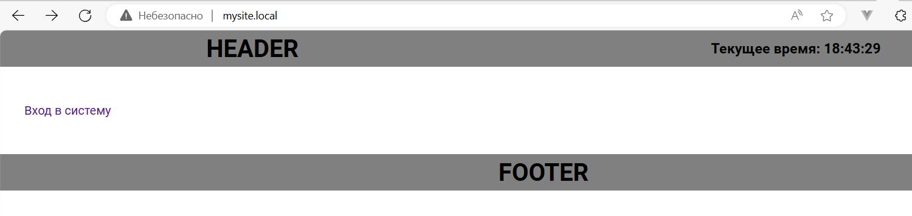
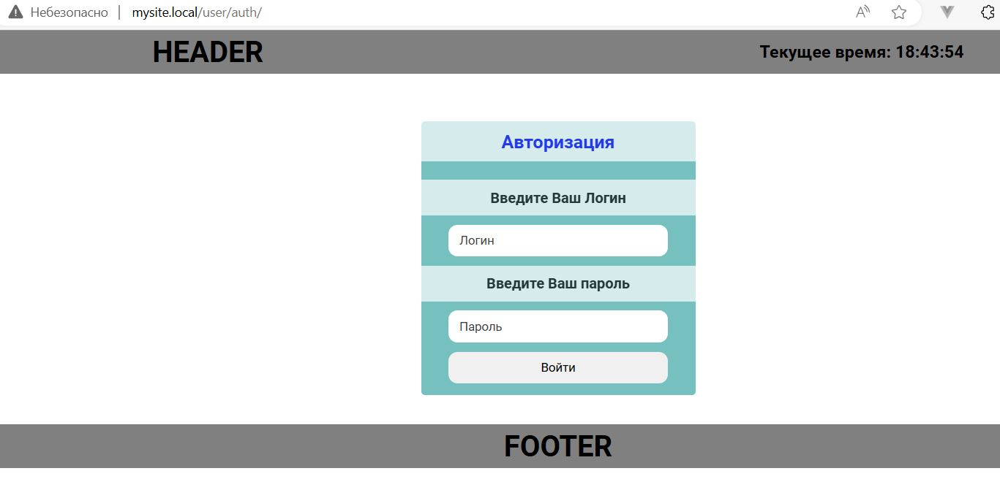
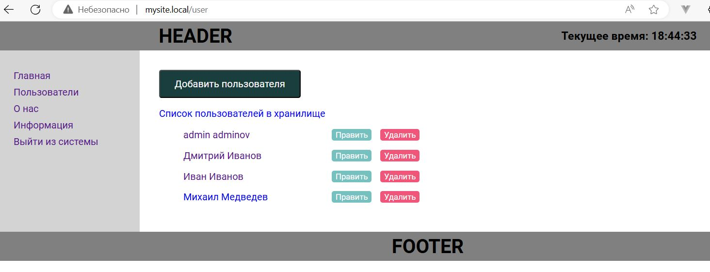

# Основы PHP

### Урок 7. Пишем личный кабинет и хранилище файлов

    Для старта проекта:
    1. В папке с проектом (hw5) - docker-compose up -d
    2. В папке cli -> docker build -t php-gb .
    3. В папке с проектом (hw5) -> 
    docker container run -it -v ${pwd}/code/:/data/mysite.local php-gb composer init
    4. Package name (<vendor>/<name>) [root/code]: -> geekbrains/application1
    5. При запросе 	Do you confirm generation [yes]? yes - yes
    6. Установить twig - в папке с проектом - 
    docker container run -it -v ${pwd}/code:/data/mysite.local/ php-gb composer require "twig/twig:^3.0"
    7. В браузере - 			http://mysite.local/
    8. Запускать собранный проект - docker-compose up -d

    Для SQL:

    CREATE TABLE `application1`.`users` (
    `id_user` INT NOT NULL AUTO_INCREMENT,
    `user_name` VARCHAR(45) NULL,
    `user_lastname` VARCHAR(45) NULL,
    `user_birthday_timestamp` INT NULL,
    PRIMARY KEY (`id_user`))
    ENGINE = InnoDB
    DEFAULT CHARACTER SET = utf8;

    CREATE TABLE `application1`.`user_roles` (
    `id_user_role` INT(11) NOT NULL AUTO_INCREMENT,
    `id_user` INT(11) DEFAULT NULL,
    `role` VARCHAR(45) DEFAULT NULL,
    PRIMARY KEY (`id_user_role`))
    ENGINE = InnoDB AUTO_INCREMENT=1 DEFAULT CHARACTER SET = latin1;

1. При помощи регулярных выражений усильте проверку данных в validateRequestData так, чтобы пользователь не смог передать на обработку любую строку, содержащую HTML-теги (например <>)

2. Доработайте шаблон аутентификации. В нем нужно добавить две вещи:

В приветствии нужно выводить имя залогинившегося пользователя.
Также надо выводить ссылку «Выйти из системы», которая будет уничтожать сессию пользователя.

3. Переработайте имеющийся функционал приложения на формы.

Создание, обновление и удаление пользователя теперь должно производиться через формы.
Если пользователь обновляется, в форму должны быть выведены текущие значения. Это может быть сделано ссылкой из списка пользователей (рядом с каждым из них будет своя ссылка “Обновить данные”).

4. *Создайте функцию “Запомнить меня” в форме логина.

В форме должен появиться checkbox “Запомнить меня”.
При нажатии на него в процессе логина пользователю выдаётся cookie, по которому происходит автоматическая авторизация, даже если сессия закончилась.
При логине нужно будет генерировать токен из random_bytes(), размещая его в cookies и БД, чтобы сравнивать их
При выходе из системы токен надо деактивировать.

5. Исправьте потолстевший Абстрактный контроллер.

