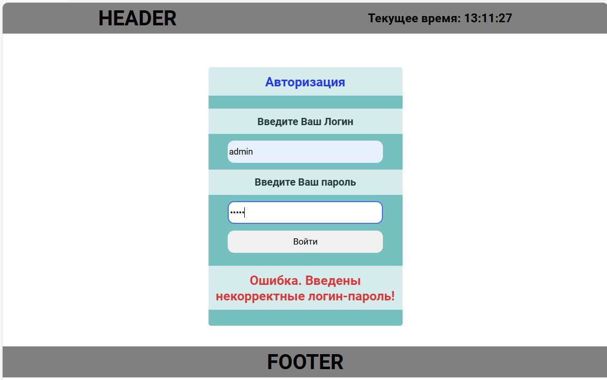

# Основы PHP

### Урок 8. Учимся собирать логи, дебажим приложение

1. В уже созданных маршрутах попробуйте вызывать их с некорректными данными. Что будет происходить? Будут ли появляться ошибки?

2. При появлении ошибок, произведите их анализ. Обязательно зафиксируйте шаги своих размышлений.
На основании анализа произведите устранение.

3. Сделайте вывод ошибки валидации поля ввода. 

